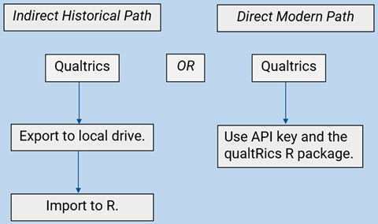
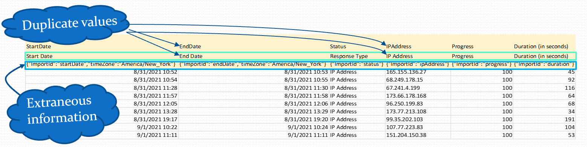
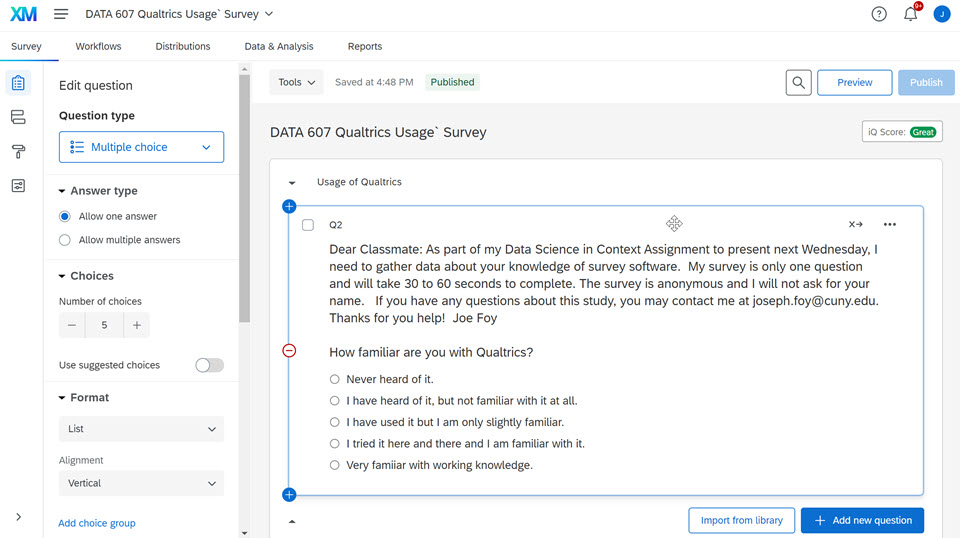
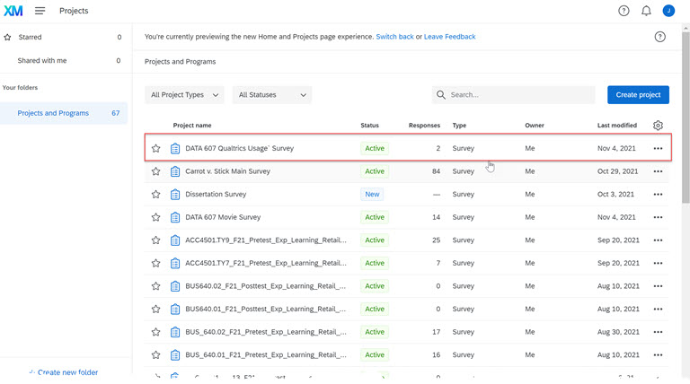
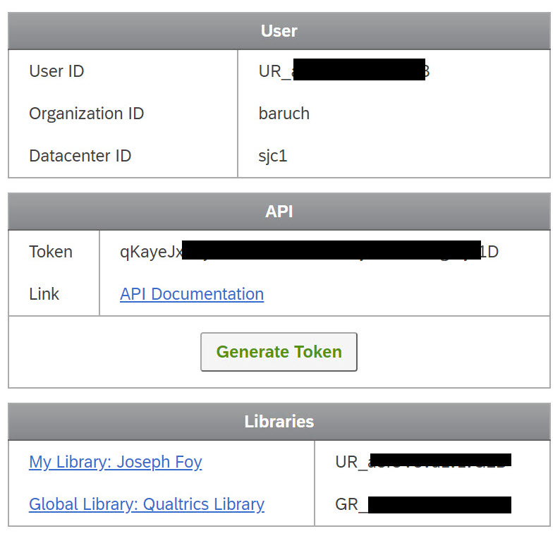
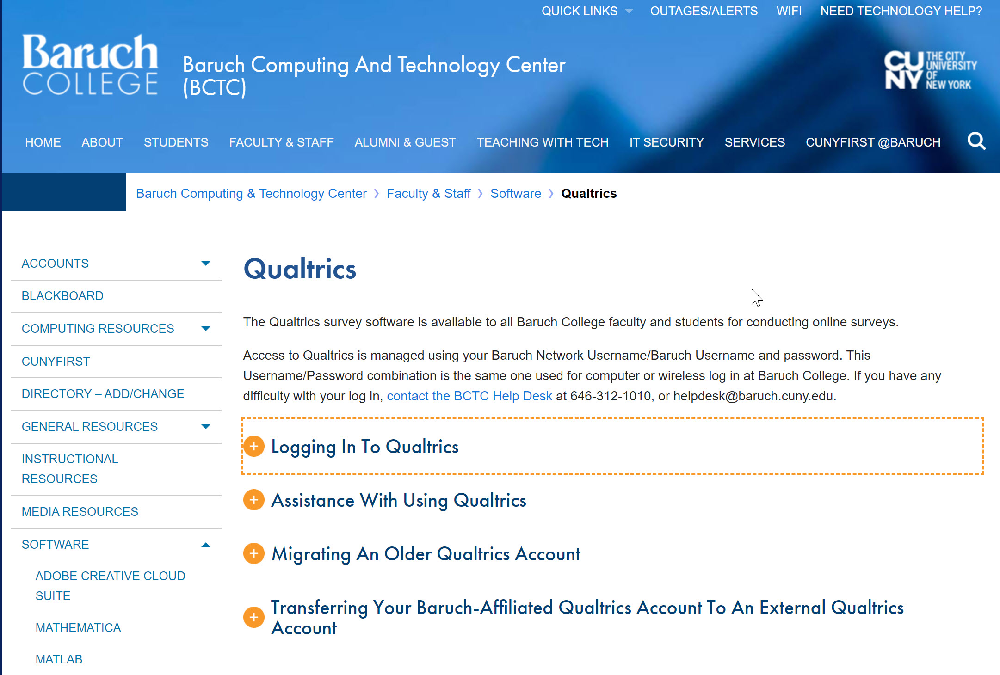
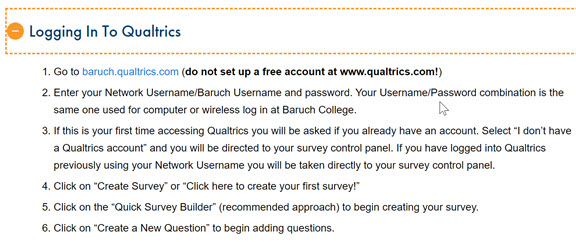

```{r setup, include=FALSE}
knitr::opts_chunk$set(echo = TRUE)
```

#### **What is Qualtrics?**

Per Qualtrics: “We build technology that closes experience gaps.”  

Basically, it is an online survey/data collection software platform.

Their customer base includes:


---
---

#### **Getting CSV Data from Qualtrics**

There are basically two paths to getting csv data from Qualtrics: Indirect and Direct.


---
---

#### **Research Problem:**

How does one reduce potential error and the amount of steps to export CSV files from Qualtrics to R?

Historically, indirectly exporting .csv data from Qualtrics and uploading to R has been more complicated than it needs to be. 

#### **Problem with Indirect Export** 

The .csv files includes rows with extraneous information.

By adding a third row (when using Qualtrics’s current standard way of exporting .csv data), Qualtrics’s .csv files cannot be read properly by standard import functions in R (e.g., read.csv()). 

R interprets the whole data frame as text/string because the second row includes characters rather than numbers. 

These extra rows invites more errors importing data into R. 


---
---

#### **Benefits of Using a Qualtrics API**

Automate repetitive processes inside of Qualtrics or to pass information in and out of Qualtrics. 

Authorities must devise methods to target the audiences they intend to reach. 

The "Generate Token" button will generate a new token every time you push it. It will overwrite and invalidate the token that existed before, thereby breaking any code that used it.

#### **Setting up a Survey**

Insert Survey Page

---
---

#### **Viewing all Surveys**


---
---

#### **Generating a Token**


---
---
  
#### **How to Get Started with Qualtrics in R**

To use the API feature, the package "qualtrRics" is necessary.  If not using the API, it is not needed.  I also loaded tidyverse to be able to transform the data.

The Qualtric API Reference Homepage has a Qualtrics API Extension Overview: https://www.qualtrics.com/support/integrations/api-integration/overview/

#### **Load Libraries**

```{r}
library(qualtRics)
library(tidyverse)
library(leaflet)
```

## **INDIRECT METHOD**

#### **Downloading CSV file to GitHub and uploading it in R**

```{r}
SurveyDownload <- read.csv("https://raw.githubusercontent.com/professorfoy/DATA-607/main/DATA%20607%20Qualtrics%20Usage%20Survey_November%206%2C%202021_09.00.csv")
```

By default, Qualtrics will generate a number of extraneous columns:
```{r}
view(SurveyDownload)
```

```{r}
names(SurveyDownload)
```

Note below that R interprets the data frame as text/string.  Note that the Progress, Duration, Longitude and Latitude of IP Addresses *are all recognized as characters*.      

```{r}
str(SurveyDownload)
```
```{r}
view(SurveyDownload)
```

## **DIRECT METHOD**

The "qualtrics_api_credentials()" function stores your API key and base url in environment variables. The .Renviron message informs us that the API key is being stored for repeated use across different sessions.

```{r}
qualtrics_api_credentials(api_key = "C7w9SmEv0Hg4tsAZWAhSldwCq6la4ou0NWyjbhN0", 
                          base_url = "baruch.sjc1.qualtrics.com",
                          install = TRUE, overwrite = TRUE)
```

#### The "all_surveys()" function fetches a list of all surveys that you own or have access to from Qualtrics.

When listing all the surveys, by default they are sorted by "id".  The"id" field is randomly generated so the list will not likely be in the most workable order.  To identify the survey that one would like to work on, the list number will need to be used.  Right now, the Qualtrics Usage Survey is number 58 on the list.

```{r}
surveys <- all_surveys()
surveys
```
To modify the list, we use dplyr from the tidyverse package and arrange the list descending by the "lastModified" date column that Qualtrics generated. 

```{r}
surveys <- all_surveys() %>% arrange(desc(lastModified))
surveys
```
#### The "fetch_survey()" function downloads a survey from Qualtrics and loads it into R.

```{r}
SurveyAPI <- fetch_survey(surveyID = surveys$id[1], 
                         verbose = TRUE)
SurveyAPI
```
```{r}
view(SurveyAPI)
```

Note below that R now interprets the data frame as text/string and nums.  Note that the Progress, Duration, Longitude and Latitude of IP Addresses *are all recognized as numeric values*.

```{r}
str(SurveyAPI)
```

```{r}
head(SurveyAPI)

```

#### **Leaflet to Plot Longitude and Latitude of IP Addresses**

Using Leaflet, a new object labeled SurveyMap was created for the dataframe. To use Leaflet, the first step is to create an centered area to plot the latitude and longitude coordinates.  The addTiles command creates the Leaflet map and the setView command using latitude and longitude coordinates for the center of Brooklyn (found by trial and error) is used as the center of the map.   The addCircles command was used to plot blue circles at each location using the latitude and longitude data from the SurveyAPI dataframe.

```{r}
# Create Leaflet map centered on Brooklyn.
SurveyMap <- SurveyAPI %>% leaflet() %>%
  addTiles() %>%
  setView(-73.95, 40.635, zoom = 11) %>%
  addCircles(lat = ~ LocationLatitude, lng = ~ LocationLongitude) 
SurveyMap
```

---
---
```{r}
CountResponses <- SurveyAPI %>% count(SurveyAPI$Q2)
CountResponses
```

#### **Distribution of choices.**

```{r}
ggplot(SurveyAPI) +
  geom_bar(aes(y = Q2),fill="blue")+
  labs(title="Qualtrics Usage Results") 
```

#### **Accessing Qualtrics Through Baruch**

https://bctc.baruch.cuny.edu/facultyandstaff/software/qualtrics/


---


---
---
#### **References**

Gadient-Bruegger, A. (2020). How to import Qualtrics csv files into R.  Retrieved from https://www.adrianbruegger.com/post/import-qualtrics-csv-files/.

Silge, J., & Ginn, J. (2021). Introduction to Qualtrics. Retrieved from https://cran.r-project.org/web/packages/qualtRics/vignettes/qualtRics.html.

StackOverflow. (2013). read.csv, header on first line, skip second line [duplicate].  Retrieved from https://stackoverflow.com/questions/15860071/read-csv-header-on-first-line-skip-second-line.

StackOverflow. (2017). How to skip second line is csv file while maintaining first line as column names with read_csv? [duplicate].  Retrieved from https://stackoverflow.com/questions/44273235/how-to-skip-second-line-is-csv-file-while-maintaining-first-line-as-column-names.

Charlton, A. (2016). Bringing in Qualtrics (and other data).  Retrieved from https://blogs.uoregon.edu/rclub/2016/05/18/bringing-in-qualtrics-and-other-data/.


  
